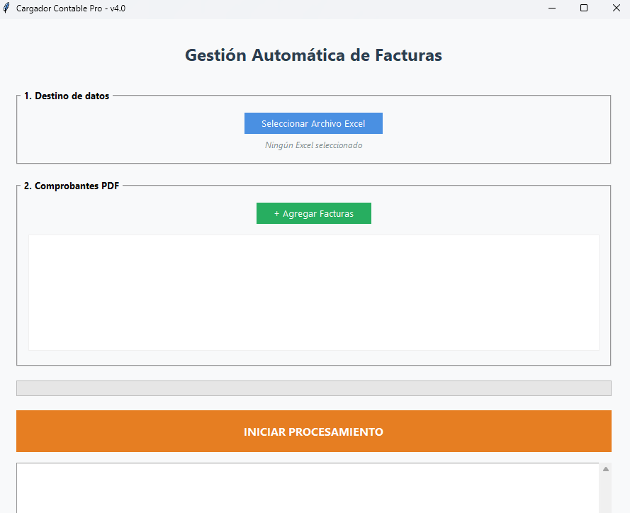

## 📄 Cargador de Facturas Pro - Google Sheets Edition
Aplicación de escritorio avanzada diseñada para profesionales en Argentina. 
Automatiza la extracción de datos desde PDFs de AFIP/ARCA (Facturas y Notas de Crédito C) y los sincroniza en tiempo real con Google Sheets.

## ✨ Características Principales
- Sincronización Cloud Nativa: Conexión directa con la API de Google Sheets. 
- No requiere manejo de archivos locales.
- Mapeo Inteligente de Datos: 
  - Estandariza métodos de pago: "Transferencia Bancaria" ➔ Transferencia, "Contado/Efectivo" ➔ Efectivo.
  - Simplifica tipos de comprobante: C o Nota de Credito C.
  - Hipervínculos Automáticos: Genera una fórmula =HYPERLINK() en la celda del PDF para abrir el archivo en Drive con un clic.
  - Respeto de Estructura (Smart Fill): Carga datos en los rangos B:G e I:J, saltando automáticamente la columna de Estado (H) y manteniendo limpia la columna de Notas (K).
  - Prevención de Duplicados: Valida el número de CAE contra la nube antes de subir, evitando registros repetidos.
  
## 📸 Vista Previa

## 📋 Requisitos del Sistema
- Instalación de Librerías
  pip install pdfplumber gspread google-auth tkinter
- Configuración de Google Cloud
  Crea un proyecto en Google Cloud Console.
  Habilita las APIs de Google Sheets y Google Drive.
  Crea una Cuenta de Servicio, descarga el JSON de la clave y renombralo a credentials.json.
    IMPORTANTE: Comparte tu Google Sheet con el email de la cuenta de servicio con permisos de Editor.
    
## 📊 Alcance de la Automatización
Columna - Campo - Lógica de Carga
A - Fecha - Omitida (Para carga manual)
B a G - Datos Fiscales - Nro Comp, Cliente, Tipo, Servicio, Importe, CAE
H - Estado - Saltada (Mantiene tus fórmulas/listas manuales)
I - Pago - Mapeo automático (Efectivo, Transferencia, etc.)
J - PDF - Link directo al archivo mediante fórmula
K - Notas - Se inicializa vacía para aclaraciones manuales

## 🚀 Instalación y Desarrollo
- Clonar el repositorio: 
  git clone https://github.com/NicoZdev/AutomatizacionTest.git
  cd AutomatizacionTest
- Preparar Credenciales: Ubica tu credentials.json en la raíz del proyecto.
- Ejecutar: 
  python cargador_facturas.py

## 📦 Generar Ejecutable (.exe)
- Debido a optimizaciones de librerías internas (charset-normalizer), se recomienda usar el siguiente comando para evitar errores de módulos faltantes:
  python -m PyInstaller --noconfirm --onefile --windowed --collect-all charset_normalizer --name "CargadorFacturas_v4" cargador_facturas.py

## 📥 Descargas
Si no eres desarrollador, puedes descargar la última versión estable desde la sección de Releases.
Nota: El archivo credentials.json debe estar en la misma carpeta que el ejecutable.

## ⚖️ Licencia
Este proyecto está bajo la Licencia MIT.
Desarrollado como solución integral para la gestión de software contable en Argentina.
